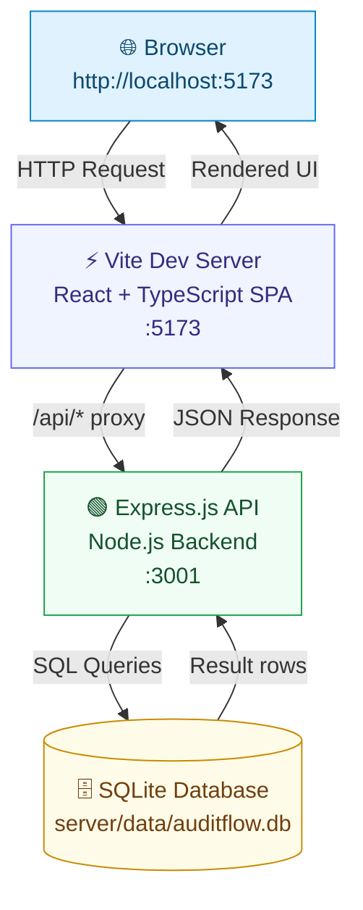
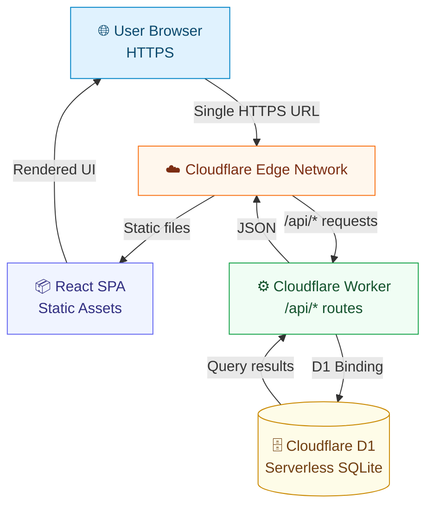
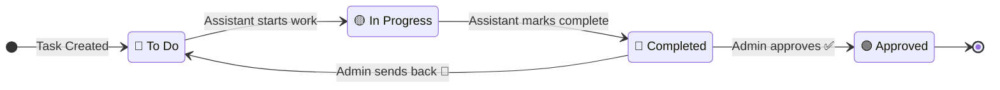
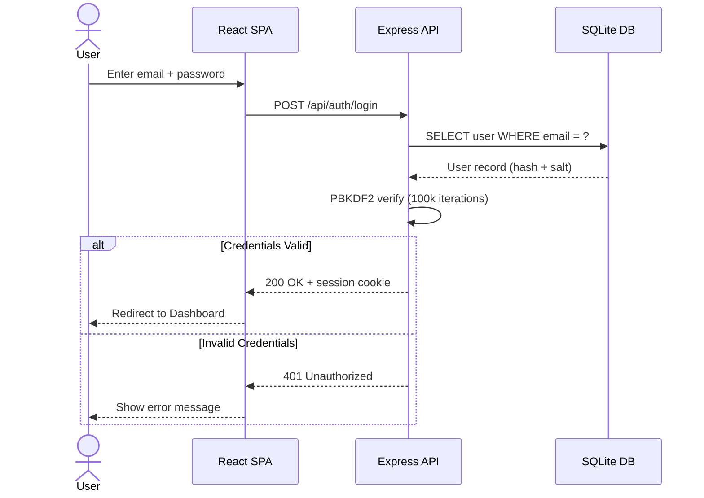
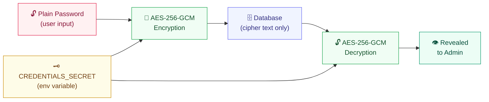
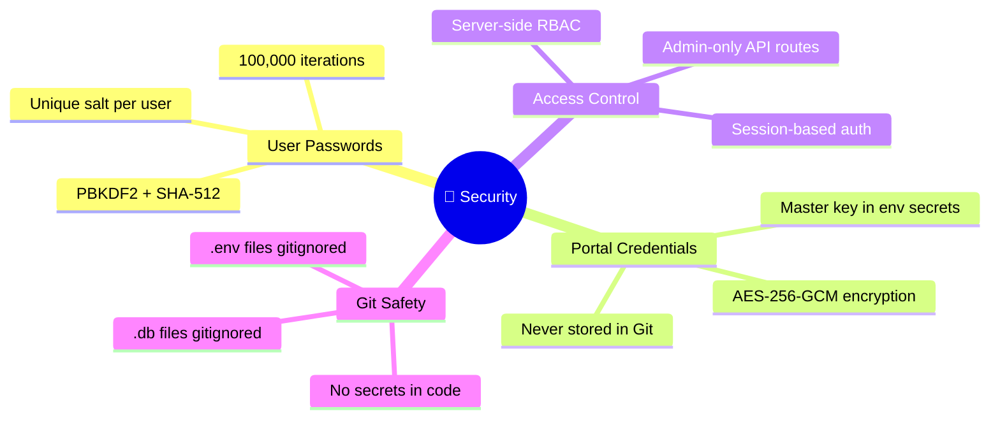
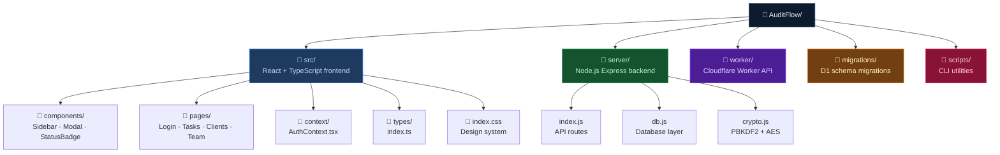

<div align="center">


# AuditFlow

### *Professional Audit & Compliance Management Platform*

**Internal web application for CA firms to manage tax compliance tasks, client records, portal credentials, and team workflows — with bank-grade encryption.**

<br />

[](https://reactjs.org/)
[](https://www.typescriptlang.org/)
[](https://vitejs.dev/)
[](https://nodejs.org/)
[](https://sqlite.org/)
[](https://developers.cloudflare.com/)

[](LICENSE)
[](https://github.com/rahul-1809/AuditFlow/pulls)
[](#-security)

</div>

---

## 📋 Table of Contents

- [✨ Features](#-features)
- [🏗️ Architecture](#%EF%B8%8F-architecture)
- [🔄 Data Flow](#-data-flow)
- [🔐 Security](#-security)
- [🚀 Quick Start](#-quick-start)
- [📁 Project Structure](#-project-structure)
- [🧪 Testing](#-testing)
- [👥 Pre-configured Demo Accounts](#-pre-configured-demo-accounts)
- [🛠️ Tech Stack](#%EF%B8%8F-tech-stack)
- [📄 License](#-license)

---

## ✨ Features

<table>
<tr>
<td width="50%">

**📋 Task Management**
- Grouped task view by client & category
- Accordion-style client groupings
- Status lifecycle: `To Do` → `In Progress` → `Completed` → `Approved`
- Admin approval & send-back workflows
- Recurring task rollover support
- Quick filters by assignee, client, status

</td>
<td width="50%">

**🏢 Client Management**
- Full client profile with GSTIN & PAN
- Multi-type client support (GST, PF, ESI, IT, MCA)
- Two-panel list + detail layout
- Portal credential vault per client
- Internal notes & contact details
- Quick search & filtering

</td>
</tr>
<tr>
<td width="50%">

**🔑 Portal Credentials Vault**
- AES-256-GCM encrypted storage
- Show/hide password toggle
- One-click clipboard copy
- Per-portal username, password & notes
- Direct portal URL linking
- Admin-only credential management

</td>
<td width="50%">

**👥 Team Management**
- Admin & Assistant role separation
- Add / deactivate team members
- Per-user task assignment & tracking
- Password reset capability
- Active session management
- Role-based access control (RBAC)

</td>
</tr>
</table>

---

## 🏗️ Architecture

### Local Development



### Production (Cloudflare Stack)



---

## 🔄 Data Flow

### Task Status Lifecycle



### Authentication Flow



### Credential Encryption



---

## 🔐 Security

> [!IMPORTANT]
> AuditFlow is built with production-grade encryption. No plain-text secrets are ever stored.



| Concern | Implementation |
|---------|---------------|
| **User Passwords** | PBKDF2 + SHA-512, 100,000 iterations, unique cryptographic salt per user |
| **Portal Credentials** | AES-256-GCM encryption with master secret key stored in environment (never in code) |
| **Database** | SQLite with no direct public access; all reads/writes go through the API layer |
| **Secrets in Git** | `.gitignore` excludes all `.env`, `.db`, and generated SQL seed files |
| **Role Separation** | Admin-only routes enforced server-side; credentials & team management are admin-gated |

---

## 🚀 Quick Start

### Prerequisites

- **Node.js** ≥ 18.x
- **npm** ≥ 9.x

### Installation

```bash
# 1. Clone the repository
git clone https://github.com/rahul-1809/AuditFlow.git
cd AuditFlow

# 2. Install all dependencies
npm install
```

### Running Locally

Open **two terminal windows**:

**Terminal 1 — Backend API:**
```bash
npm run server
# → Express API running at http://127.0.0.1:3001
```

**Terminal 2 — Frontend:**
```bash
npm run dev
# → Vite dev server at http://127.0.0.1:5173
```

Then open **http://127.0.0.1:5173** in your browser.

> [!NOTE]
> The Vite dev server proxies all `/api/*` requests to the Express backend automatically. No CORS issues in local development.

---

## 📁 Project Structure



---

## 🧪 Testing

Run the end-to-end API verification suite against the running local backend:

```bash
# Make sure npm run server is running first
npm test
```

This validates all 10 core acceptance requirements including:
- Authentication & session management
- Task CRUD operations & status transitions
- Client & credential management APIs
- Admin-only route access control
- Encryption round-trips

---

## 👥 Pre-configured Demo Accounts

> [!CAUTION]
> These credentials are for **local development only**. The production database starts clean — create your own admin via `npm run create-admin`.

| Role | Email | Password |
|------|-------|----------|
| **Admin** | `admin@auditflow.internal` | `admin123` |
| **Assistant 1** | `priya@auditflow.internal` | `assistant123` |
| **Assistant 2** | `amit@auditflow.internal` | `assistant123` |

---

## 🛠️ Tech Stack

```mermaid
graph LR
    subgraph Frontend["🖥️ Frontend"]
        React["React 19"]
        TS["TypeScript 6"]
        Vite["Vite 8"]
        Lucide["Lucide React"]
    end

    subgraph Backend["⚙️ Backend"]
        Node["Node.js 18+"]
        Express["Express 5"]
        SQLite["SQLite"]
        Crypto["Node Crypto\nPBKDF2 · AES-256"]
    end

    subgraph Production["☁️ Production"]
        CFWorker["Cloudflare Workers"]
        D1["Cloudflare D1"]
        Wrangler["Wrangler CLI"]
    end

    Frontend -->|"REST /api"| Backend
    Backend -->|"Deploy"| Production

    style Frontend fill:#1e3a5f,stroke:#3b82f6,color:#bfdbfe
    style Backend fill:#14532d,stroke:#16a34a,color:#bbf7d0
    style Production fill:#7c2d12,stroke:#f97316,color:#fed7aa
```



| Layer | Technology | Version | Purpose |
|-------|-----------|---------|---------|
| **UI Framework** | React | 19.x | Component-based SPA |
| **Type System** | TypeScript | 6.x | Static type safety |
| **Build Tool** | Vite | 8.x | Dev server & bundler |
| **Icons** | Lucide React | 1.52+ | Icon library |
| **Runtime** | Node.js | 18+ | Backend runtime |
| **HTTP** | Express | 5.x | REST API framework |
| **Local DB** | SQLite | built-in | Development database |
| **Password Hash** | PBKDF2 + SHA-512 | Node crypto | User auth security |
| **Encryption** | AES-256-GCM | Node crypto | Credential vault |
| **Edge API** | Cloudflare Workers | — | Serverless production API |
| **Edge DB** | Cloudflare D1 | — | Serverless SQLite at edge |

---

## 📄 License

This project is licensed under the **MIT License** — see the [LICENSE](LICENSE) file for details.

---

<div align="center">

**Built with ❤️ for CA firms that need a professional, secure audit management tool.**

[](https://github.com/rahul-1809)
[](https://github.com/rahul-1809/AuditFlow)

</div>
